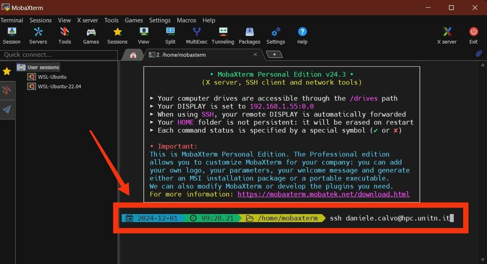
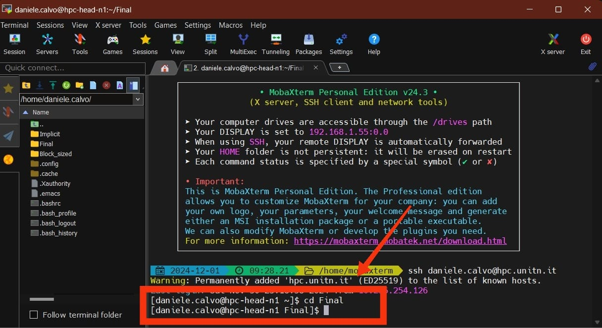
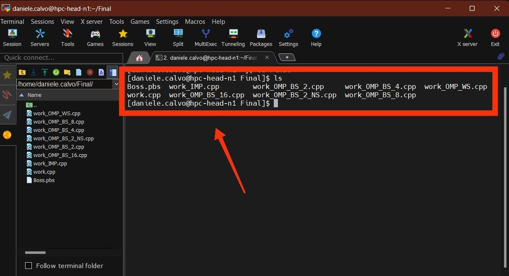
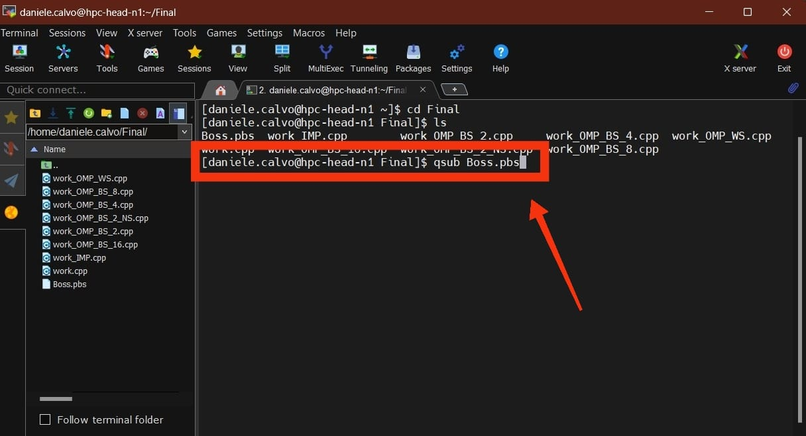
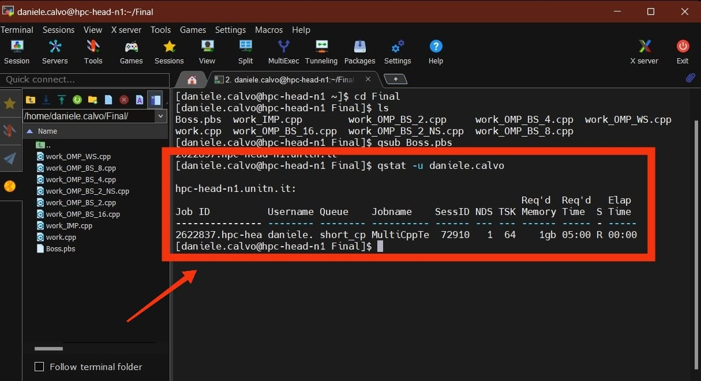

# IntroPARCO_2024_H1_Calvo
This project has the purpose to undertand if it's better to parallelize the project instead of keeping it sequential and what parallelization logic is better, knowing the number of threads available in the hardware.

# What to do
## Installing GlobalProtect
[Click here to install the VPN necessary to use the cluster safely](https://servicedesk.unitn.it/sd/it/kb-article/globalprotect-palo-alto-client-downloads?id=kb_article_view&sysparm_article=KB0011269)

when you open it, put as portal `vpn-mfa.icts.unitn.it`

## Installing MobaXTerm
MAC and Linux provide a built-in SSH client, but I'm on windows so I installed Mobaxterm (PuTTY is a valid alternative). To install mobaxterm, visit [the official web page](https://mobaxterm.mobatek.net/)
## Accessing the cluster
with the terminal (for MAC and Linux) or mobaxterm open, digit `ssh YourName.YourSurname@hpc.unitn.it` and with the password of the istitutional mail you can access the cluster

## Compiling the `.pbs` file
Move the desired directory into your mobaxterm

Then, digit into the terminal cd `Name of the directory you want to use`

use ls to see the files available

after you saw the name of the pbs file, use qsub `NameOfThePbsFile.pbs` to run it

with qstat -u `YourName.YourSurname`

